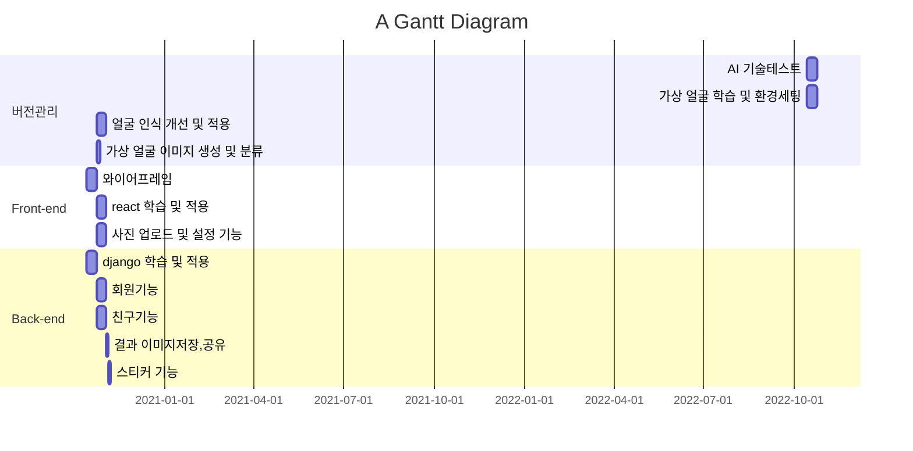

# ICES-HomePage
ICES Lab. 을 대표하는 홈페이지를 제작합니다.


 > <https://ices-lab.github.io/ICES-HomePage/>


## 작업 규칙
 - **master에 직접 올리지 마세요 !**
 - **Force-commit 이나 hard 옵션 등을 사용하지 마세요 !**
 - **질문 및 건의사항은 슬랙을 적극 사용해주세요 ! :+1:**
 - 작업 branch는 feature/[이름약자]-[작업내용] 형태로 올려주세요. 
   - ex) feature/[TJ]-ProfilePage
   - **Branch 유지 기간은 일주일을 넘기지 마세요. (충돌방지)**
 - Commit Message는 한글로 최대한 자세히 적어주세요.
 - 작업물을 push 후에 pull requests를 진행해주세요.


## 작업 기간
### 📖 Gantt :fire:


- 2022.05.23 ~ 2022.05.29 외관 보수 및 MEMBER 페이지 개발
  - [X] **개발환경 구축 및 버전 관리**
  - [X] 교수님 약력 및 수상 수집
  - [X] 박사과정 및 학부생 프로필 작성

## Installation
```
 > git clone https://github.com/ICES-Lab/ICES-HomePage.git

 > npm i
```


## Browsers support

| [](http://godban.github.io/browsers-support-badges/)<br/>IE / Edge | [](http://godban.github.io/browsers-support-badges/)<br/>Firefox | [](http://godban.github.io/browsers-support-badges/)<br/>Chrome | [](http://godban.github.io/browsers-support-badges/)<br/>Safari | [](http://godban.github.io/browsers-support-badges/)<br/>iOS Safari | [](http://godban.github.io/browsers-support-badges/)<br/>Samsung |
| --------- | --------- | --------- | --------- | --------- | --------- |
| IE11, Edge| last version| last version| last version| last version| last version
